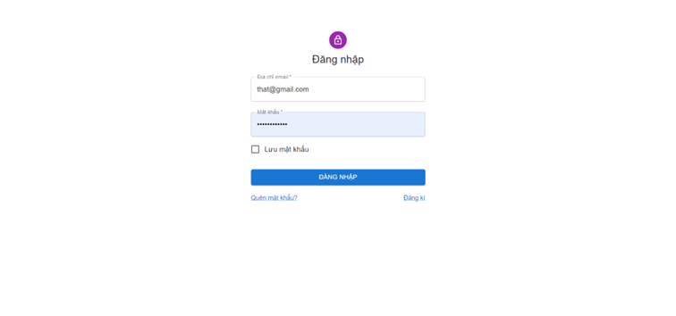
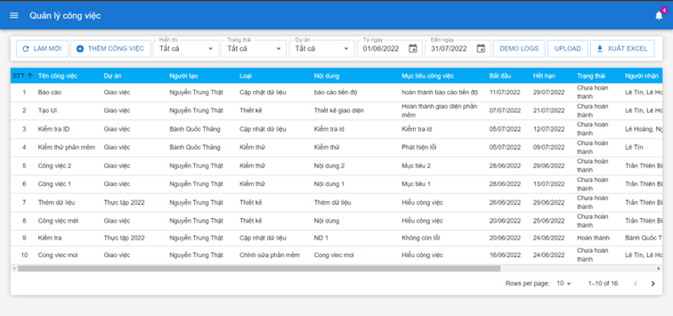
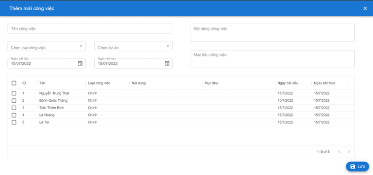
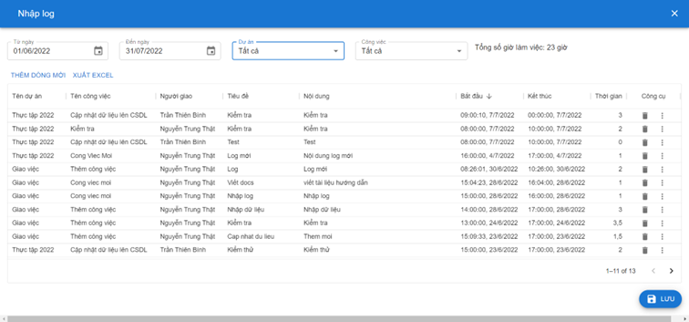
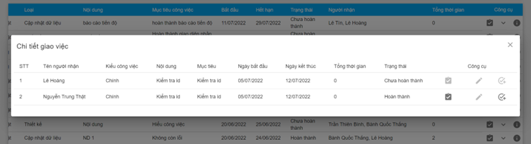

# How to run

- Open terminal
- Clone code: `git clone https://github.com/winofwin292/giao-viec-ui.git`
- Run: `npm install`
- Run: `npm start`

Open [http://localhost:3000](http://localhost:3000) to view it in your browser.
The page will reload when you make changes.\

# Demo

